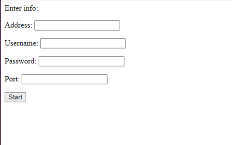

# maxpatrol
Программа для удаленного считывания информации о системе через SSH подключение. 
Интерфейс выполнен с помощью Django, для SSH подлкючения используется библиотека paramiko. Информация, собранная программой, вместе с логами выполненных команд хранится в бд Postgre.
На приложенных скриншотах отображены интерфейс ввода информации для подключения и формат вывода полученной информации.\
\

